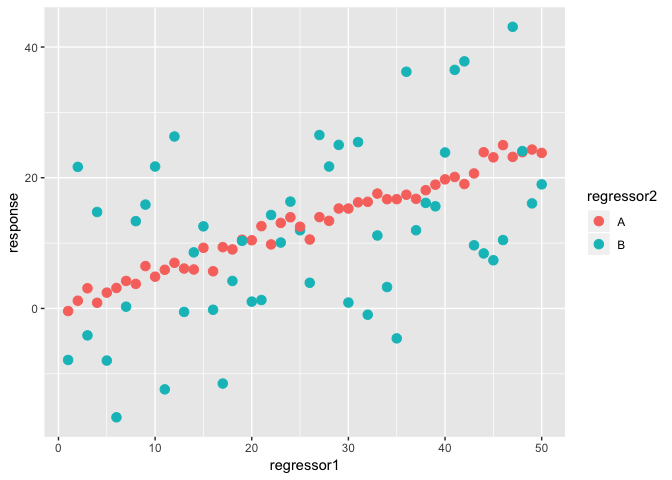

Linear model fitting examples
================

Example 3
---------

#### Generate data

``` r
set.seed(2)
regressor1<-c(1:50,1:50)
regressor2<-c(rep("A",50), rep("B",50))
response<-c(regressor1[1:50]*0.5+rnorm(50,0,1),regressor1[51:100]*0.5+rnorm(50,0,10))
dat<-data.frame(response,regressor1,regressor2)
dat<-dat[sample(1:nrow(dat),nrow(dat), replace = F),]
head(dat)
```

    ##     response regressor1 regressor2
    ## 86 36.221225         36          B
    ## 64  8.581648         14          B
    ## 60 21.716188         10          B
    ## 95  7.373292         45          B
    ## 37 16.774020         37          A
    ## 78 21.717898         28          B

Regressor 1 is continuous. Regressor 2 is categorical.

#### Visualize the data

``` r
library(ggplot2)
ggplot(data = dat, aes(x = regressor1, y = response, color = regressor2))+geom_point(size = 3)
```



#### The linear model

*y*<sub>*i*</sub> = *β*<sub>0</sub> + *β*<sub>1</sub>*x*<sub>*i*1</sub> + *β*<sub>2</sub>*x*<sub>*i*2</sub>
 or
\[*r**e**s**p**o**n**s**e*\]<sub>*i*</sub> = *β*<sub>0</sub> + *β*<sub>1</sub>\[*r**e**g**r**e**s**s**o**r*1\]<sub>*i*1</sub> + *β*<sub>2</sub>\[*B*\]<sub>*i*2</sub>
 where *B* = 0, 1

1.  Use two regressors

``` r
fit <- lm(response~1+regressor1+regressor2, data = dat)
summary(fit)
```

    ## 
    ## Call:
    ## lm(formula = response ~ 1 + regressor1 + regressor2, data = dat)
    ## 
    ## Residuals:
    ##     Min      1Q  Median      3Q     Max 
    ## -20.376  -2.720  -0.157   1.517  21.800 
    ## 
    ## Coefficients:
    ##             Estimate Std. Error t value Pr(>|t|)    
    ## (Intercept)  1.13803    1.92249   0.592    0.555    
    ## regressor1   0.45808    0.05886   7.782 7.76e-12 ***
    ## regressor2B -1.37448    1.69885  -0.809    0.420    
    ## ---
    ## Signif. codes:  0 '***' 0.001 '**' 0.01 '*' 0.05 '.' 0.1 ' ' 1
    ## 
    ## Residual standard error: 8.494 on 97 degrees of freedom
    ## Multiple R-squared:  0.3869, Adjusted R-squared:  0.3743 
    ## F-statistic: 30.61 on 2 and 97 DF,  p-value: 4.946e-11

1.  Use just regressor 1

``` r
fit <- lm(response~1+regressor1, data = dat)
summary(fit)
```

    ## 
    ## Call:
    ## lm(formula = response ~ 1 + regressor1, data = dat)
    ## 
    ## Residuals:
    ##      Min       1Q   Median       3Q      Max 
    ## -21.0629  -2.8609   0.4863   1.9723  21.1129 
    ## 
    ## Coefficients:
    ##             Estimate Std. Error t value Pr(>|t|)    
    ## (Intercept)  0.45079    1.72161   0.262    0.794    
    ## regressor1   0.45808    0.05876   7.796 6.89e-12 ***
    ## ---
    ## Signif. codes:  0 '***' 0.001 '**' 0.01 '*' 0.05 '.' 0.1 ' ' 1
    ## 
    ## Residual standard error: 8.479 on 98 degrees of freedom
    ## Multiple R-squared:  0.3828, Adjusted R-squared:  0.3765 
    ## F-statistic: 60.78 on 1 and 98 DF,  p-value: 6.889e-12

1.  Use just regressor 2

``` r
fit <- lm(response~1+regressor2, data = dat)
summary(fit)
```

    ## 
    ## Call:
    ## lm(formula = response ~ 1 + regressor2, data = dat)
    ## 
    ## Residuals:
    ##     Min      1Q  Median      3Q     Max 
    ## -28.103  -7.307   0.394   6.147  31.649 
    ## 
    ## Coefficients:
    ##             Estimate Std. Error t value Pr(>|t|)    
    ## (Intercept)   12.819      1.523   8.416 3.26e-13 ***
    ## regressor2B   -1.374      2.154  -0.638    0.525    
    ## ---
    ## Signif. codes:  0 '***' 0.001 '**' 0.01 '*' 0.05 '.' 0.1 ' ' 1
    ## 
    ## Residual standard error: 10.77 on 98 degrees of freedom
    ## Multiple R-squared:  0.004137,   Adjusted R-squared:  -0.006025 
    ## F-statistic: 0.4071 on 1 and 98 DF,  p-value: 0.5249

1.  Use just category A

``` r
fit <- lm(response~1+regressor1, data = dat[dat$regressor2=="A",])
summary(fit)
```

    ## 
    ## Call:
    ## lm(formula = response ~ 1 + regressor1, data = dat[dat$regressor2 == 
    ##     "A", ])
    ## 
    ## Residuals:
    ##     Min      1Q  Median      3Q     Max 
    ## -2.5155 -0.6281 -0.1246  0.7525  2.1411 
    ## 
    ## Coefficients:
    ##             Estimate Std. Error t value Pr(>|t|)    
    ## (Intercept)  0.34196    0.32460   1.053    0.297    
    ## regressor1   0.48930    0.01108  44.167   <2e-16 ***
    ## ---
    ## Signif. codes:  0 '***' 0.001 '**' 0.01 '*' 0.05 '.' 0.1 ' ' 1
    ## 
    ## Residual standard error: 1.13 on 48 degrees of freedom
    ## Multiple R-squared:  0.976,  Adjusted R-squared:  0.9755 
    ## F-statistic:  1951 on 1 and 48 DF,  p-value: < 2.2e-16

1.  Use just category B

``` r
fit <- lm(response~1+regressor1, data = dat[dat$regressor2=="B",])
summary(fit)
```

    ## 
    ## Call:
    ## lm(formula = response ~ 1 + regressor1, data = dat[dat$regressor2 == 
    ##     "B", ])
    ## 
    ## Residuals:
    ##     Min      1Q  Median      3Q     Max 
    ## -20.079  -8.711  -2.246   9.340  22.471 
    ## 
    ## Coefficients:
    ##             Estimate Std. Error t value Pr(>|t|)    
    ## (Intercept)   0.5596     3.4470   0.162  0.87171    
    ## regressor1    0.4269     0.1176   3.628  0.00069 ***
    ## ---
    ## Signif. codes:  0 '***' 0.001 '**' 0.01 '*' 0.05 '.' 0.1 ' ' 1
    ## 
    ## Residual standard error: 12 on 48 degrees of freedom
    ## Multiple R-squared:  0.2152, Adjusted R-squared:  0.1989 
    ## F-statistic: 13.17 on 1 and 48 DF,  p-value: 0.0006898
